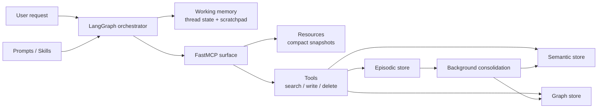
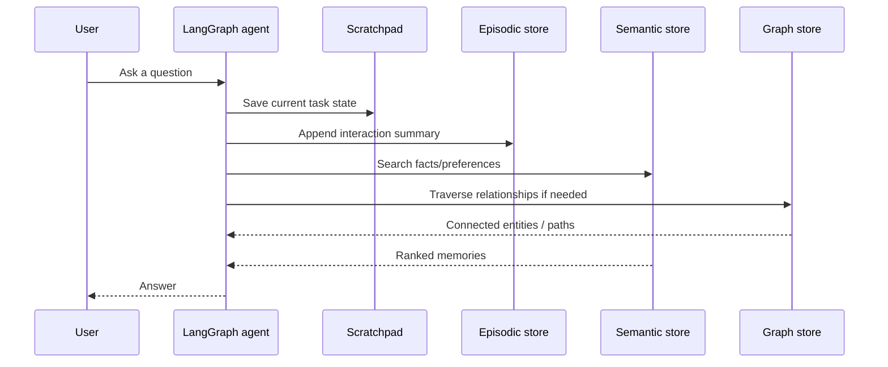

# MCP Memory Architecture for WARNERCO Schematica

## Executive summary

The short answer is **no**: **MCP is not, by itself, a memory architecture**. The current Model Context Protocol specification gives you standardized ways to expose **tools**, **resources**, and **prompts** from servers, and **sampling** and **roots** from clients. It also now includes **elicitation** as a newer client-side interaction feature. What it does **not** define is a canonical model for long-term agent memory such as identity-scoped facts, episodic histories, semantic belief updates, deletion semantics, or multi-agent memory sharing. In practice, **“memoryful MCP” is an application-layer design problem that MCP can expose cleanly, not a capability MCP natively solves**. citeturn1view0turn1view1turn1view2turn1view4turn1view5

For the repo behind **WARNERCO Schematica**, the best fit is to treat **MCP as the interface layer** and keep **memory as a separately modeled subsystem** behind the existing adapters. The repository already points in that direction: it describes a **7-node LangGraph pipeline**, a **FastAPI + FastMCP** surface, and a **hybrid memory layer** built from **JSON**, **Chroma**, **Azure AI Search**, a **graph store**, and an in-memory **scratchpad**. The visible backend tree also already separates **HTTP routes**, **MCP stdio**, **MCP tools**, **LangGraph flow**, **store adapters**, and **models**, which is exactly the seam you want if you plan to evolve memory without rewriting the protocol surface. citeturn31view0turn33view0turn34view0turn35view0turn36view0turn36view1turn37view0

My strongest recommendation is this: **keep LangGraph as the owner of working memory and orchestration, keep FastMCP as the interoperability surface, and move long-term memory into explicit storage tiers with clear ownership and deletion rules**. Use **resources** only for **small, inspectable, read-mostly snapshots**. Use **tools** for **search**, **writes**, **promotion**, **graph traversal**, **invalidations**, and **deletes**. Treat **prompts** and **skills** as **procedural memory**, not user memory. That split is both technically clean and consistent with the MCP spec, CoALA’s memory taxonomy, and what current production frameworks are actually doing. citeturn1view1turn3view0turn4view0turn16view1turn16view0

If I were shipping this repo in a Microsoft-first enterprise environment today, I would choose **LangGraph + FastMCP + Azure AI Search + a real episodic store + the existing scratchpad + an optional graph layer**, rather than building on **OpenAI Assistants threads** or a fully opinionated stateful-agent runtime. **Mem0** is the fastest managed path if you want “memory now.” **Zep / Graphiti** is the best fit if **temporal facts and relationship evolution** become first-class. **Letta** is compelling if you want memory to be the center of the runtime. But for this codebase, **LangGraph plus an explicit memory subsystem gives the best control-to-complexity ratio**. citeturn18view0turn18view1turn19view0turn19view2turn20view1turn21view0turn21view2

## What MCP gives you today

The current official MCP specification is organized around **capabilities**, not around a built-in persistence model. In the current spec, the server side exposes **resources**, **prompts**, and **tools**. The client side exposes **sampling** and **root directory lists**. The spec also includes lifecycle and authorization layers. That is a clean contract surface, but it is still just that: a contract surface. It says how an AI host and a server can exchange context and actions. It does not tell you how to represent a user profile, how to reconcile contradictory facts, how to expire memories, or how to isolate one tenant’s memory from another’s. citeturn1view0turn1view1

The one genuinely new wrinkle is **elicitation**. The draft/current elicitation page says the feature is **newly introduced** and may still evolve, and it supports both structured in-band question flows and **URL mode** for out-of-band actions such as third-party auth or sensitive data collection. That is useful for memory workflows, because it gives an MCP server a standard way to ask a user for missing information. But it still is **not** a durable memory model. It is a way to gather missing context. citeturn1view2

FastMCP mirrors that separation cleanly. Its docs frame servers around **tools, resources, and prompts**, and its sampling support is explicitly about allowing tools to request model generation through the client or a configured provider. Again, great plumbing. Not a built-in belief store. citeturn1view3turn1view4turn1view5

### What each MCP primitive should mean in a memoryful system

| MCP primitive | What it is in the spec | What it should be used for in a memory architecture | My take |
|---|---|---|---|
| **Resources** | Read-oriented server features | **Small, stable, inspectable snapshots** such as `user_profile_summary`, `active_project_constraints`, `session_scratchpad_snapshot`, or `memory_stats` | Great for **deterministic views** of memory, bad for full memory corpora |
| **Tools** | Imperative actions | `memory_search`, `memory_upsert`, `episode_append`, `graph_neighbors`, `memory_delete`, `scratchpad_clear` | This is where real memory retrieval and mutation belongs |
| **Prompts** | Parameterized message templates | Few-shot packs, runbooks, response styles, extraction playbooks | These are **procedural memory**, not semantic memory |
| **Sampling** | Client feature for LLM generation | Optional helper when a tool needs model help during execution | Useful, but not a memory layer |
| **Roots** | Client-provided directory roots | File scoping and local corpus grounding | Helpful for file access, not for cross-session memory |
| **Elicitation** | Client-mediated information requests | Ask user for missing preferences, IDs, approvals, labels | Good for “gaps in context,” not for persistence |

The clean design rule is the one that usually wins in production: **resources are views, tools are operations, prompts are procedures**. If a thing is mutable, large, dynamic, privacy-sensitive, or tenant-scoped, it should almost always be **tool-driven**, not **resource-loaded**. Loading giant memory corpora as resources is the AI equivalent of dragging your whole garage onto the stage because you needed one screwdriver. citeturn1view1turn1view2turn1view4turn1view5

## What good agent memory actually looks like

The most useful formal lens here is **CoALA**. It breaks agent memory into **working**, **episodic**, **semantic**, and **procedural** memory. That taxonomy holds up unusually well against today’s frameworks. It also exposes why so many “memory” demos are just disguised prompt-stuffing. If all you have is a growing transcript, you have at best a fragile form of working memory and a terrible form of long-term memory. citeturn3view0turn4view0

### A practical CoALA mapping

| CoALA memory type | What it means | Concrete implementation in this stack |
|---|---|---|
| **Working memory** | Active state for the current decision cycle | LangGraph thread state, checkpointer state, tool outputs, scratchpad |
| **Episodic memory** | Prior events and task trajectories | Session summaries, interaction logs, Zep-style episodes, task outcome records |
| **Semantic memory** | Facts, preferences, knowledge | User facts, domain knowledge, structured summaries, vector / graph facts |
| **Procedural memory** | How to behave and what steps to follow | System prompts, MCP prompts, Anthropic skills, tool policies, code |

CoALA explicitly says working memory is the active hub, episodic memory stores experiences, semantic memory stores world knowledge, and procedural memory includes the agent’s code and behavior. That maps almost one-for-one to **LangGraph state**, **episode summaries**, **vector or graph facts**, and **prompts/skills/tool code**. citeturn4view0

This also matches what the influential memory papers actually teach. **Generative Agents** succeeded by combining **observation**, **reflection**, and **retrieval** rather than shoving all history into context. **MemGPT** framed the problem as **virtual memory management**, where context must be paged intelligently rather than treated as infinite. **LongMemEval** evaluates exactly the abilities that break naive systems in the real world: **information extraction**, **multi-session reasoning**, **temporal reasoning**, **knowledge updates**, and **abstention**. **LoCoMo** stresses very long dialog histories across many sessions. The common lesson is brutal and simple: **memory quality matters more than memory quantity**. citeturn9search1turn10search0turn9search6turn8search2turn8search10

That leads to four practical rules.

First, **working memory must stay small and explicit**. LangGraph’s docs are right to emphasize thread-scoped state and checkpointed conversation memory. That should hold the current task, not your whole biography. citeturn18view0turn18view1

Second, **episodic memory should usually be append-only and summarizable**. Raw transcripts are useful for audit and replay. They are poor retrieval units for downstream reasoning unless you summarize and label them. Zep’s **episode** concept is strong here because it preserves provenance and time. citeturn21view1turn21view3

Third, **semantic memory needs conflict handling and time awareness**. Mem0 explicitly talks about extraction and conflict resolution. Zep explicitly tracks `valid_at` and `invalid_at` on facts. Those are not “nice to haves.” They are what separates memory from a rumor mill. citeturn19view1turn21view2

Fourth, **procedural memory should be versioned and reviewed**. Anthropic’s Skill docs and enterprise guidance make this very clear: skills are powerful because they are reusable behavior packages, and dangerous for the exact same reason. Procedural memory is where your agent can learn bad habits fast. citeturn17view0turn17view1

## The framework landscape

The market is now full of things called “memory,” but they are not all playing the same instrument. Some are basically **RAG with better ergonomics**. Some are **stateful agent runtimes**. Some are **temporal fact graphs**. Some are **skill systems**, which is procedural memory wearing a nicer jacket.

### Comparison matrix

| System | Best at | Statefulness model | MCP-native in reviewed docs | Isolation / deletion / observability | Lock-in | Verdict |
|---|---|---|---|---|---|---|
| **LangGraph + LangMem** | Working memory, application-controlled long-term memory, procedural/semantic memory under your ownership | Thread checkpoints + namespace/key stores + hot-path or background memory extraction | **No first-class MCP memory surface in reviewed docs**; commonly paired with MCP servers or adapters | You own the store and deletion model; strong persistence/checkpoint semantics; good control, weaker turnkey governance | **Low to moderate** | Best default for this repo citeturn18view0turn18view1turn18view2turn18view3turn30search12 |
| **Mem0** | Managed semantic memory and layered user/session/org memory | Layered conversation, session, user, org memory; extraction + conflict handling | **Yes** via Mem0 MCP | Docs highlight governance, audit logs, hosted stack, and AgentOps integration; detailed delete semantics were not fully reviewed here | **Moderate to high** on platform | Fastest product path if you want managed memory now citeturn19view0turn19view1turn19view2turn19view3turn29search0turn29search4 |
| **Letta** | Memory-first stateful agents with in-context core memory plus archival retrieval | Persistent **memory blocks** in context + **archival memory** in vector DB | **Indirect**: strong MCP support for external servers/tools, but memory is primarily Letta-native | Strong memory abstraction; shared blocks; enterprise skill vetting guidance; more opinionated runtime | **Moderate** | Great if you want a memory-centric agent platform, heavier than needed for WARNERCO citeturn20view0turn20view1turn20view2turn20view3turn29search3turn29search7 |
| **Zep / Graphiti** | Temporal fact memory, provenance, user/group graphs, relationship reasoning | User graphs, group graphs, episodes, fact invalidation, valid/invalid time | **Yes**, experimental MCP server | Reviewed docs are unusually explicit on tenant isolation, episode deletion effects, and time attributes | **Moderate** | Best fit when time and changing relationships are first-class requirements citeturn21view0turn21view1turn21view2turn21view3turn22search10turn22search11turn29search1 |
| **Cognee** | Hybrid graph + vector memory with ontology management and flexible storage | Persistent knowledge engine plus session-aware memory; graph/vector hybrid | **Yes** | Docs and README call out access control, session management, and OTEL-style tracing; maturity and operational ergonomics need more hands-on validation | **Moderate** | Interesting and ambitious; better if you want ontology-heavy enterprise knowledge memory citeturn28view0turn28view1turn28view2turn29search2turn29search14 |
| **Semantic Kernel** | RAG, vector-store abstraction, chat reduction, contextual tool selection in Microsoft ecosystems | Chat history reducers + vector store connectors + agent framework | **Not first-class in reviewed docs** | Good Azure/.NET ergonomics; memory-store connectors are legacy, vector stores are the modern path | **Moderate** within Microsoft stack | Strong choice for Microsoft shops, but not a full memory operating system by itself citeturn26view0turn26view1turn26view2turn26view3turn26view4 |
| **Google ADK + Memory Bank** | Managed learned memory on Google stack | Session/state + `MemoryService`; `InMemoryMemoryService` or `VertexAiMemoryBankService` | **Indirect** | Isolation uses `user_id` and `app_name`; managed bank is clearly platform-tied | **High** to Google Cloud | Strong if you are already in Google Agent Platform; not my first choice here citeturn23view0turn23view1turn23view2 |
| **AutoGen** | Agent orchestration with pluggable memory protocol | `Memory` protocol with implementations like `ListMemory` | **Not evidenced in the reviewed memory docs** | Very flexible, but memory is intentionally thin and composable, not opinionated or managed | **Low** | Good orchestration framework, not my pick as the primary memory layer citeturn24view0turn24view1turn24view2 |
| **OpenAI Assistants threads + file_search** | Session persistence and hosted corpus search | Threads store message history and truncate; file_search retrieves from vector stores | **No**; this is not MCP memory | Hosted, convenient, but not a full memory model; **Assistants API is deprecated** and shuts down **August 26, 2026** | **High** | Do not start new memory architecture work here citeturn27view0turn27view1turn27view2turn27view3 |
| **Anthropic Files + Skills + Memory tool** | Claude-centric procedural memory, reusable files, and client-side persistent memory | Memory tool CRUDs a `/memories` directory; Skills are reusable packaged procedures; Files are reusable uploaded artifacts | **Yes for MCP connector**, and memory is an official tool primitive | Enterprise guidance is strong; memory tool is client-side and excellent for just-in-time context, but it is not your app’s multi-tenant system of record by itself | **Moderate to high** around Claude | Excellent for Claude-facing workflows; not sufficient alone as the only backend memory system for this repo citeturn16view0turn17view0turn17view1turn17view2turn17view3turn15view2 |

### Verified public version markers

Official release/version visibility is inconsistent across frameworks, so this is the **high-confidence subset I could verify directly**.

| Component | Verified marker |
|---|---|
| **MCP spec** | Current spec path is **`2025-11-25`** citeturn1view0turn1view1 |
| **FastMCP sampling** | Sampling docs say **“New in version 2.0.0”** citeturn1view4 |
| **Anthropic memory tool** | Beta launch noted **September 29, 2025**; GA noted **February 17, 2026** citeturn15view2turn16view0 |
| **Anthropic Agent Skills** | Public docs and launch/blog material appear **October 2025**; enterprise docs are live in current docs set citeturn17view0turn17view1turn13search7 |
| **OpenAI Assistants API** | Deprecated now; shutdown scheduled for **August 26, 2026** citeturn27view0 |
| **Semantic Kernel vector store docs** | Public Learn page dated **July 1, 2025** and still marked preview/RC citeturn25search2turn26view0 |
| **Google ADK memory blog** | Public long-term memory explainer dated **August 1, 2025**; managed Memory Bank quickstart is current in the Agent Platform docs set citeturn11search2turn23view1turn23view2 |

## The right architecture for WARNERCO Schematica

The repo tells a pretty coherent story already. The top-level README describes **WARNERCO Schematica** as a **FastAPI + FastMCP + LangGraph** teaching app with a **7-node LangGraph flow** and a hybrid memory layer. The backend README says the data-store architecture keeps **JSON** as **source of truth**, with **Chroma** and **Azure AI Search** as semantic backends and an existing set of MCP tools for graph and scratchpad operations. The visible backend tree shows these likely module seams:

- `app/main.py`
- `app/mcp_stdio.py`
- `app/mcp_tools.py`
- `app/api/routes.py`
- `app/langgraph/flow.py`
- `app/adapters/base.py`
- `app/adapters/factory.py`
- `app/adapters/json_store.py`
- `app/adapters/chroma_store.py`
- `app/adapters/azure_search_store.py`
- `app/adapters/graph_store.py`
- `app/adapters/scratchpad_store.py`
- `app/models/schematic.py`
- `app/models/graph.py`
- `app/models/scratchpad.py` citeturn31view0turn33view0turn34view0turn35view0turn36view0turn36view1turn37view0

That is already the skeleton of a serious memory architecture. It just needs one shift in mindset: **stop thinking of memory as one thing**.

### What I would keep

I would keep **JSON as source of truth for schematics**. The repo is explicit about that, and it is the right move. It gives you a canonical corpus that is easy to diff, test, regenerate embeddings from, and validate independently of any particular indexing backend. That prevents your vector index from turning into the only surviving copy of the score after the studio computer crashes. citeturn33view0

I would keep **LangGraph** as the orchestration owner. LangGraph’s checkpoint/thread model is exactly what you want for **working memory** and durable execution semantics. The repo’s visible `app/langgraph/flow.py` suggests that is already the center of coordination. citeturn18view1turn35view0

I would also keep the **adapter boundary**. The existing adapter set is a gift. It means you can swap memory implementations without turning `mcp_tools.py` into a junk drawer. citeturn36view0

### What I would change

I would make the memory model **four-tier**, not “hybrid” in the vague sense.

**Working memory** should live in **LangGraph state + scratchpad** only. The scratchpad should be small, thread-scoped, and aggressively minimized. It is for active reasoning, not history hoarding. The repo already exposes scratchpad MCP tools, which is a good sign. citeturn33view0turn18view0turn18view1

**Episodic memory** should become an explicit durable store. The visible repo docs mention scratchpad and graph features, but from the tree/README surface I could not verify a dedicated episode log or summary store. That is the first thing I would add. Episodes should record **interaction summaries, decisions, failures, and outcomes**, with timestamps, provenance, and deletion hooks. This is the missing bridge between transient agent state and long-lived semantic memory. That inference is based on the repo surfaces I could see, not on a code-level review of every file. citeturn31view0turn33view0turn34view0turn35view0turn36view0turn36view1turn37view0

**Semantic memory** should be a proper retrieval layer. For this repo, in your environment, my default production answer is **Azure AI Search**. The repo already supports it, and it fits a Microsoft/Azure ecosystem better than bolting on a second strategic platform. If you want lower-cost local iteration, keep **Chroma** for development and maybe CI smoke tests. But for production in this stack, **Azure AI Search** is the grown-up answer. citeturn33view0turn26view0turn26view2

**Graph memory** should stay optional and surgical. Keep `graph_store.py`, but do not force everything through it. Use it only when you truly need **relationship queries**, **path queries**, or **temporally changing facts**. If WARNERCO mainly needs “find the best schematic matching this intent,” vector retrieval plus structured metadata will do more work than graph traversal. If WARNERCO evolves toward “what changed between actuator A, supplier B, and revision C over time,” then a Zep/Graphiti-style temporal graph becomes much more attractive. citeturn33view0turn21view0turn21view2

### What the MCP surface should look like

The repo currently lists MCP tools for robots, semantic search, graph operations, and scratchpad operations. That is directionally correct. I would now split the surface deliberately.

Use **resources** for compact canonical views such as:

- `robot://{id}/summary`
- `memory://session/{thread_id}/snapshot`
- `memory://user/{user_id}/profile`
- `memory://stats`

Use **tools** for operational memory work such as:

- `memory.search`
- `memory.upsert_fact`
- `memory.append_episode`
- `memory.invalidate_fact`
- `memory.delete_scope`
- `graph.neighbors`
- `graph.path`
- `scratchpad.write`
- `scratchpad.clear`

Use **prompts** for extraction and behavior patterns such as:

- “summarize interaction into episodic event”
- “extract user preferences”
- “generate graph triplets with confidence”
- “explain source provenance to user”

That is the cleanest interface contract because it keeps **memory introspection** declarative and **memory change** imperative. It also lets Claude Desktop, Claude Code, VS Code, or any other MCP-capable host reason about the system without slurping the whole pantry into context. citeturn31view0turn33view0turn1view1turn1view5

### My concrete recommendation

If I had to commit the next serious architecture move today, it would be this:

1. **Keep the current FastAPI + FastMCP + LangGraph structure**.  
2. **Treat `scratchpad_store.py` as working memory only**.  
3. **Add an explicit episodic store and episode summarization path**.  
4. **Use `azure_search_store.py` as the production semantic memory backend**.  
5. **Keep `graph_store.py` for relationship/path queries, not as the default store for everything**.  
6. **Expose compact resources and operational tools separately**.  
7. **Version procedural memory** in prompts/skills, with review gates for mutations.  
8. **Add delete-by-tenant, delete-by-user, and delete-by-thread APIs early**, before the memory corpus gets sticky.  

That architecture stays close to this repo’s current shape, fits the Microsoft-first toolchain better than the obvious alternatives, and avoids the trap of turning MCP into a database cosplay layer. citeturn31view0turn33view0turn34view0turn36view0turn18view1turn26view0

## Evaluation, risks, and open questions

The biggest architectural risk is **cross-session contamination**. If you let long-term semantic memory become an unreviewed landfill, the agent will confidently reuse stale or wrong facts. Zep’s explicit invalidation model and LongMemEval’s focus on **knowledge updates** exist for a reason. A memory system that cannot forget and update is not really memory. It is fan fiction. citeturn21view2turn9search6

The second risk is **tenant leakage**. Multi-agent reusable memory sounds clever until one customer’s steel-guitar settings leak into another customer’s robotics query. Any real implementation here needs a namespace design such as:

`tenant_id / app_id / user_id / agent_id / thread_id / memory_type`

Zep’s docs are strong on graph isolation, and LangGraph’s stores use namespaces directly. Those are the right instincts. citeturn22search11turn18view2

The third risk is **procedural drift**. Anthropic’s enterprise skill guidance is useful here: skills and similar procedural packages can expand capability, but they can also bypass guardrails or change agent behavior in ways that are hard to see until something ugly happens. Any system that lets the agent write or update procedures must keep **human review**, **versioning**, and **rollback**. citeturn17view1

The fourth risk is **observability debt**. The memory layer needs first-class tracing of **what was retrieved**, **why it was retrieved**, **what changed**, **what got invalidated**, and **what was deleted**. Mem0 explicitly integrates with AgentOps. Cognee explicitly calls out tracing and audit traits. The repo should adopt the same mindset even if it uses different tooling. citeturn19view3turn28view2

### What to measure

An eval harness for this repo should focus on six things:

| Eval dimension | Why it matters |
|---|---|
| **Cross-session fact recall** | Tests whether the system remembers stable user/domain facts |
| **Temporal update correctness** | Tests that the newest valid fact wins |
| **Relationship-path accuracy** | Tests whether graph memory is actually earning its rent |
| **Abstention on absent memory** | Prevents the agent from hallucinating fake recall |
| **Deletion correctness** | Verifies privacy and compliance behavior |
| **Cost/latency per turn** | Stops memory from becoming a token furnace |

That set is directly aligned with the hardest benchmark lessons from **LongMemEval** and **LoCoMo**. citeturn9search6turn8search2turn8search10

### Open questions and limitations

A few things remain incomplete from this pass.

I could verify the **backend tree and README-level architecture**, but I did **not** fully inspect the internals of every Python file in `src/warnerco/backend/app`, so any statement about exact runtime behavior below the visible module/file level should be treated as **architectural inference**, not a line-by-line code audit. citeturn33view0turn34view0turn35view0turn36view0turn36view1turn37view0

Release/version visibility across framework docs is uneven. I included only the **high-confidence public version markers** I could verify directly. In a few cases, especially for Mem0, Letta, Zep, and Cognee, the official docs/pages I reviewed described capabilities clearly but did not expose a neatly comparable “latest release date” in the same way the major vendor docs did. citeturn19view2turn20view4turn21view0turn28view0

The one architectural choice that still depends on product direction is the **graph question**. If WARNERCO mostly needs semantic similarity over schematics, Azure AI Search plus structured metadata will carry a lot of weight. If you expect **changing relationships over time**, **path questions**, or **multi-hop reasoning** to become central, then Zep/Graphiti becomes much more compelling. citeturn33view0turn21view0turn21view2

## Annotated source list

**MCP specification and capability model.**  
The current official MCP spec and overview were the anchor for separating protocol primitives from memory design. They are the cleanest evidence that **MCP standardizes interfaces, not durable memory semantics**. citeturn1view0turn1view1

**Elicitation in MCP.**  
Important because it shows how the protocol is evolving around user interaction and missing context, while still not becoming a full memory model. citeturn1view2

**FastMCP docs.**  
Useful for showing how a real MCP framework maps the spec into actual server features and sampling support. citeturn1view3turn1view4turn1view5

**CoALA.**  
The most useful conceptual bridge between agent research and real engineering decisions. It gives the working/episodic/semantic/procedural split that makes the framework comparison sane instead of mushy. citeturn3view0turn4view0

**Generative Agents, MemGPT, LongMemEval, LoCoMo.**  
These supplied the most important lessons from the agent-memory literature: reflection beats transcript stuffing, paging matters, update handling matters, and abstention matters. citeturn9search1turn10search0turn9search6turn8search2turn8search10

**LangGraph and LangMem docs.**  
Best evidence for why LangGraph is a strong working-memory/orchestration center and why LangMem is useful for hot-path or background long-term memory extraction without forcing a whole runtime opinion. citeturn18view0turn18view1turn18view2turn18view3turn18view4

**Mem0, Letta, Zep, and Cognee docs.**  
These were the main framework sources for comparing layered memory, archival memory, temporal graph memory, ontology-rich graph/vector memory, MCP integration, and governance posture. citeturn19view0turn19view1turn19view2turn20view0turn20view1turn20view2turn21view0turn21view1turn21view2turn28view1turn28view2

**Semantic Kernel, Google ADK, AutoGen, OpenAI, and Anthropic docs.**  
These were the key vendor references for understanding where memory is a **feature**, where it is a **protocol**, where it is a **hosted retrieval tool**, and where it is really just **session history plus helpers**. citeturn26view0turn26view1turn26view4turn23view0turn23view1turn24view0turn27view0turn27view1turn27view2turn16view0turn17view0turn17view2turn17view3

**The GitHub repo for WARNERCO Schematica.**  
This was the practical anchor. The visible README and backend tree were enough to identify the existing seams and recommend an architecture that fits the codebase rather than fantasizing a greenfield rebuild. citeturn31view0turn33view0turn34view0turn35view0turn36view0turn36view1turn37view0